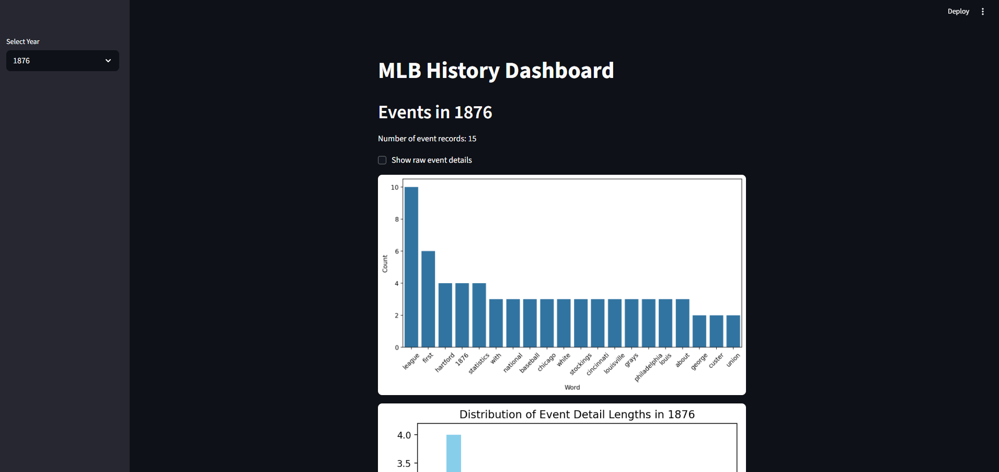
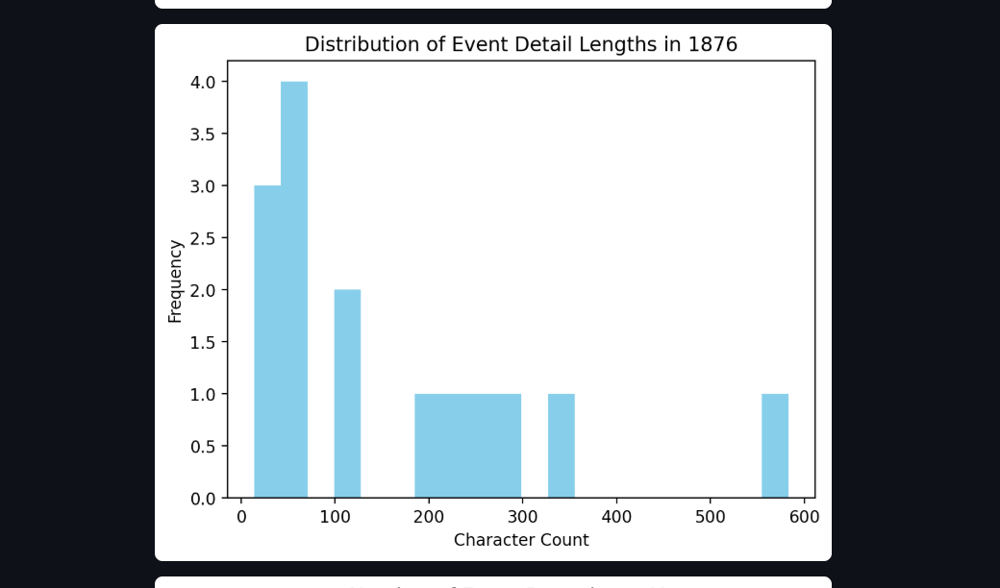
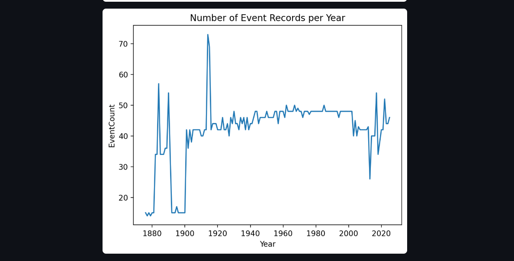
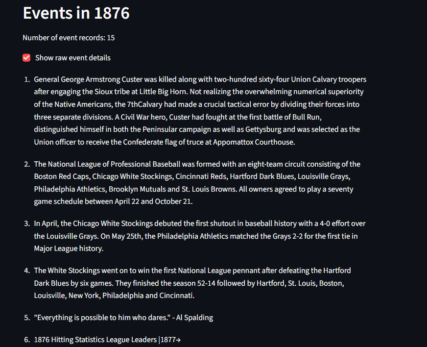
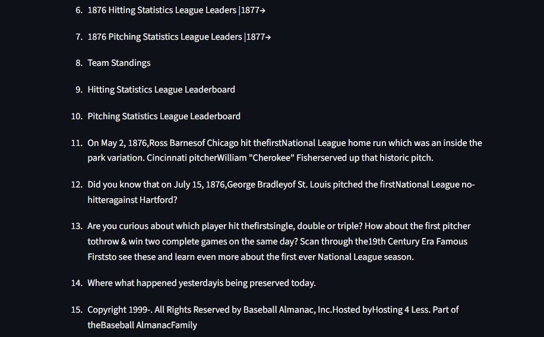

# MLB History Scraper

This project uses Selenium to scrape historical baseball data from the MLB website and saves it in CSV format.

## Features

- Automates browser navigation
- Handles pagination and missing tags
- Outputs structured CSV files

## Setup

```bash
python -m venv venv
source venv/bin/activate
pip install -r requirements.txt
```

# MLB History Web Scraping and Dashboard Project

## Overview

This project scrapes historical Major League Baseball (MLB) data from [Baseball Almanac](https://www.baseball-almanac.com/yearmenu.shtml) using Selenium (and alternatively Requests + BeautifulSoup), cleans and transforms the data, stores it in a SQLite database, and presents interactive visualizations in a Streamlit dashboard.

## Features

- **Web Scraping:** Retrieves year-wise MLB historical events, handling pagination, missing tags, and user-agent headers.
- **Data Cleaning:** Cleans and filters raw data using Pandas to ensure quality and consistency.
- **Database Import:** Imports cleaned CSV data into SQLite tables for efficient querying.
- **Database Query Program:** Command-line interface to query the database with flexible SQL queries including joins and filters.
- **Interactive Dashboard:** Streamlit app with three visualizations, featuring dropdowns and filters to explore MLB history by year.

## Project Structure

```
mlb-history-project/
├── data/ # Raw and cleaned CSV data
│ ├── mlb_year_links.csv
│ └── mlb_year_details.csv
├── db/
│ └── mlb_history.db # SQLite database with imported data
├── scripts/
│ ├── scrape_year_links.py # Scrapes year URLs
│ ├── scrape_year_pages_bs4.py # Scrapes yearly event details (Requests + BeautifulSoup version)
│ ├── import_to_db.py # Imports CSVs into SQLite database
│ ├── query_db.py # CLI program to query the database
│ └── dashboard.py # Streamlit dashboard app
├── README.md # This file
└── requirements.txt # Python dependencies
```

## Run the scrapers:

#### To scrape the MLB year links:

```bash
python scripts/scrape_year_links.py
```

#### To scrape yearly event details:

```bash
python scripts/scrape_year_pages.py
```

## Import CSV data into SQLite database:

```bash
python scripts/import_to_db.py
```

## Query the database via CLI:

```bash
python scripts/query_db.py
```

## Run the interactive dashboard:

```bash
streamlit run scripts/dashboard.py
```

Open your browser at http://localhost:8501 to explore the dashboard.

## Screenshots of DashBoard (localhost:8501)

### Dashboard Main View










